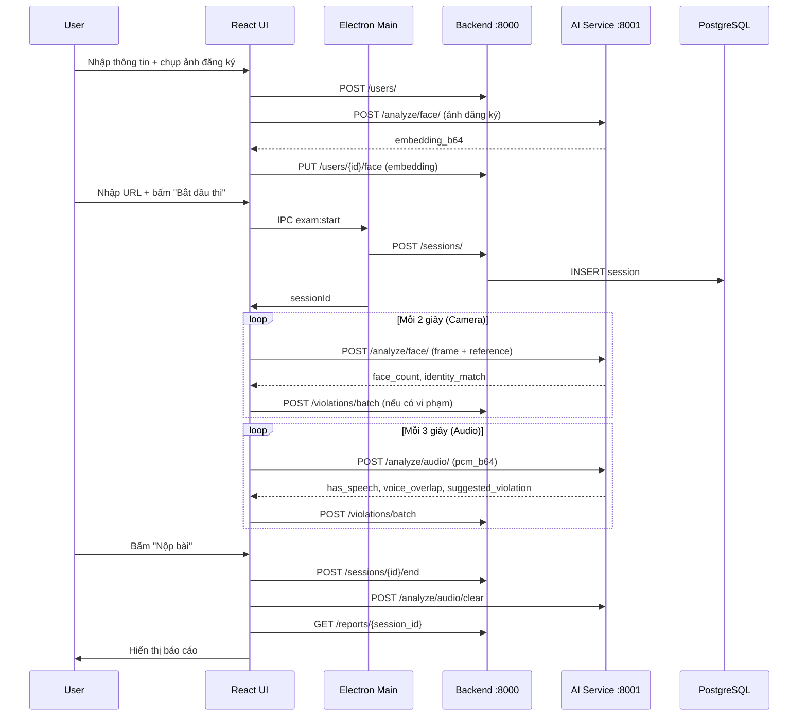

# SecureExam – Walkthrough & Build Summary

## Những gì đã được xây dựng

Một hệ thống thi trực tuyến chống gian lận hoàn chỉnh với 4 tầng:

---

## Cây thư mục hoàn chỉnh

```
secure app/
├── README.md
├── docker-compose.yml
├── config/
│   ├── app.yaml                    # Global settings, ports
│   ├── whitelist.yaml              # Allowed exam URLs (glob patterns)
│   ├── camera.yaml                 # Face detection thresholds
│   └── audio.yaml                  # VAD + MFCC thresholds
│
├── backend/                        # FastAPI + PostgreSQL
│   ├── Dockerfile
│   ├── requirements.txt
│   ├── pyproject.toml
│   ├── main.py                     # App entry + CORS + router mount
│   ├── core/
│   │   ├── config.py               # Settings via pydantic-settings
│   │   ├── database.py             # Async SQLAlchemy engine
│   │   └── logger.py               # structlog JSON logger
│   ├── models/
│   │   ├── user.py
│   │   ├── session.py
│   │   └── violation.py
│   ├── api/
│   │   ├── schemas.py              # Pydantic request/response schemas
│   │   └── routes/
│   │       ├── users.py
│   │       ├── sessions.py
│   │       ├── violations.py       # Includes /batch endpoint
│   │       └── reports.py
│   ├── services/
│   │   ├── session_service.py
│   │   ├── violation_service.py
│   │   └── report_service.py
│   ├── migrations/
│   │   └── init.sql                # PostgreSQL schema + seed
│   └── tests/
│       ├── conftest.py             # SQLite in-memory fixtures
│       ├── test_sessions.py
│       └── test_violations.py
│
├── ai-service/                     # Python AI analysis
│   ├── Dockerfile
│   ├── requirements.txt
│   ├── pyproject.toml
│   ├── main.py
│   ├── core/
│   │   ├── config.py
│   │   └── logger.py
│   ├── modules/
│   │   ├── face/
│   │   │   ├── detector.py         # InsightFace buffalo_sc detection
│   │   │   ├── recognizer.py       # Cosine similarity recognition
│   │   │   └── analyzer.py         # Orchestrator (decode → detect → recognize)
│   │   └── audio/
│   │       ├── vad.py              # WebRTC VAD (30ms frames, 16kHz)
│   │       ├── feature_extractor.py # MFCC extraction + cosine distance
│   │       └── analyzer.py         # Stateful per-session audio analyzer
│   ├── api/
│   │   ├── schemas.py
│   │   └── routes/
│   │       ├── face.py
│   │       └── audio.py
│   └── tests/
│       ├── test_face.py            # Mock InsightFace tests
│       └── test_audio.py           # Synthetic PCM tests
│
└── desktop/                        # Electron + React
    ├── package.json
    ├── tsconfig.json
    ├── webpack.config.js
    ├── electron/
    │   ├── main.ts                 # BrowserWindow + BrowserView lifecycle
    │   ├── preload.ts              # contextBridge IPC surface
    │   ├── browser-guard.ts        # URL whitelist enforcement + JS injection
    │   └── ipc-handlers.ts         # ipcMain.handle() → backend/AI calls
    └── src/
        ├── index.html
        ├── index.tsx
        ├── index.css               # Full design system (dark mode)
        ├── App.tsx                 # Page router: setup→exam→report
        ├── pages/
        │   ├── SetupPage.tsx       # Registration + face capture + URL
        │   ├── ExamPage.tsx        # Live monitoring toolbar + side panel
        │   └── ReportPage.tsx      # Post-exam report with timeline
        ├── components/
        │   ├── CameraMonitor.tsx   # Live preview + face status
        │   ├── AlertBanner.tsx     # Auto-dismiss violation alert
        │   └── ViolationList.tsx   # Scrollable violation log
        └── hooks/
            ├── useCamera.ts        # Camera stream + periodic AI analysis
            ├── useMicrophone.ts    # WebAudio PCM capture + chunked analysis
            └── useViolations.ts    # Violation state + batched backend writes
```

---

## Luồng hoạt động



---

## Hướng dẫn chạy

### Bước 1: Chạy services qua Docker
```bash
docker-compose up --build -d
```

### Bước 2: Kiểm tra health
```bash
curl http://localhost:8000/health
curl http://localhost:8001/health
```

### Bước 3: Chạy desktop app
```bash
cd desktop
npm install
npm run dev
```

### Bước 4: Chạy tests
```bash
# Backend
cd backend && pip install pytest pytest-asyncio httpx aiosqlite
pytest tests/ -v

# AI service
cd ai-service && pip install -r requirements.txt
python -m pytest tests/ -v
```

---

## Các quyết định thiết kế quan trọng

| Quyết định | Lý do |
|-------------|-------|
| InsightFace `buffalo_sc` | Model nhẹ nhất trong họ InsightFace, chạy được trên CPU |
| WebRTC VAD | Google's VAD chạy trong vài microseconds, mode 3 = aggressive nhất |
| MFCC cosine distance | Không cần training, so sánh real-time, nhẹ |
| BrowserView thay vì webview | BrowserView cho phép kiểm soát navigation tốt hơn |
| Batch violations API | Giảm HTTP calls, tránh lag UI khi nhiều vi phạm liên tiếp |
| SQLite trong tests | Không cần PostgreSQL cho unit tests |
| Per-session audio state | State ở AI service, không cần DB, tự động GC khi session kết thúc |

---

## Nâng cấp tiếp theo (MVP → Production)

- [ ] Authentication/JWT cho admin dashboard
- [ ] WebSocket thay HTTP cho violation stream (real-time hơn)
- [ ] GPU support cho InsightFace (thay ctx_id=-1 → 0)
- [ ] Video recording (lưu clip 10s xung quanh vi phạm nghiêm trọng)
- [ ] Admin web portal để xem báo cáo tất cả thí sinh
- [ ] Alembic migrations thay vì raw SQL
- [ ] Rate limiting + API authentication
